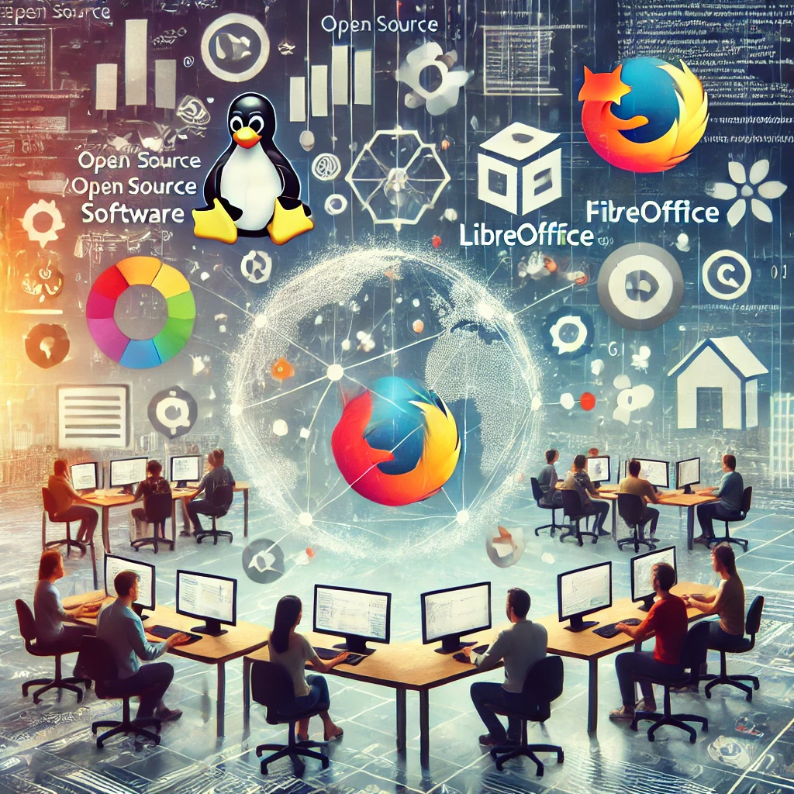

```{r open, echo=FALSE, out.width = '50%', fig.align = "center", fig.cap="L'Open source, photo générée par une IA."}

```

## Introduction

L’open source est devenu un élément clé du développement numérique moderne. Ce modèle repose sur le partage du code source, permettant à chacun d'utiliser, de modifier et de redistribuer librement un logiciel. Contrairement aux logiciels propriétaires, qui limitent l'accès au code et imposent des restrictions aux utilisateurs, l’open source encourage l’innovation collaborative et favorise une transparence accrue.

L’histoire de l’open source remonte aux années 1980 avec le projet GNU, lancé par Richard Stallman, qui voulait créer un système d’exploitation entièrement libre. Ce projet a conduit à la naissance de Linux en 1991, un système d’exploitation open source développé par Linus Torvalds. Aujourd’hui, Linux est utilisé partout : des serveurs internet aux smartphones Android en passant par les supercalculateurs.

Dans le domaine des logiciels de bureautique, OpenOffice (et son successeur LibreOffice) s’est imposé comme une alternative gratuite à Microsoft Office. Ce logiciel permet d’éditer des documents, des tableurs et des présentations sans payer de licence, ce qui en fait une solution populaire pour les particuliers, les écoles et les administrations publiques.

L’open source ne concerne pas seulement les développeurs, mais aussi des millions d’utilisateurs qui bénéficient de logiciels gratuits, sécurisés et évolutifs. Son adoption par de grandes entreprises et gouvernements témoigne de son impact croissant sur le numérique. Cependant, il soulève aussi des questions stratégiques, notamment en matière de financement, de sécurité et d’indépendance technologique.

## 1. Les outils et technologies open source incontournables

L’open source a donné naissance à une multitude de technologies qui sont aujourd’hui incontournables dans le paysage numérique. Ces outils, utilisés par des millions de personnes et d’entreprises, offrent des alternatives viables aux logiciels propriétaires et favorisent l’innovation collaborative.

#### Systèmes d’exploitation

Linux, lancé en 1991 par Linus Torvalds, est l'un des projets open source les plus influents. Avec des distributions populaires comme Ubuntu, Debian ou Fedora, Linux est aujourd’hui largement utilisé dans les serveurs, les supercalculateurs et le cloud computing. Il est apprécié pour sa stabilité, sa sécurité et son adaptabilité. 


#### Logiciels de bureautique

LibreOffice et son prédécesseur OpenOffice sont des alternatives gratuites et open source à Microsoft Office. Ils permettent d’éditer des documents, des tableurs et des présentations tout en garantissant une compatibilité avec les formats courants. Ces outils sont très prisés par les administrations et les écoles cherchant à réduire leurs coûts logiciels.[@bertagnoli_28_2024]

#### Navigateurs web

Mozilla Firefox est l’un des rares navigateurs open source à rivaliser avec les solutions propriétaires comme Google Chrome. Il se distingue par son engagement en faveur de la protection de la vie privée et son modèle de développement ouvert. Firefox repose sur le moteur Gecko, qui assure un rendu web performant tout en respectant les standards ouverts du web.[@bertagnoli_28_2024]

#### Développement et gestion de code

Des plateformes comme GitHub et GitLab facilitent la collaboration sur les projets open source. Elles permettent aux développeurs de partager leur code, de gérer les versions et de suivre les contributions. GitHub, bien que détenu par Microsoft, reste un acteur majeur de l’écosystème open source, tandis que GitLab propose une alternative auto-hébergée et libre. 

Ces outils démontrent la capacité de l’open source à proposer des solutions performantes et accessibles, favorisant un numérique plus ouvert et collaboratif.

## 2. Enjeux économiques et stratégiques de l’open source

L'open source présente plusieurs avantages économiques qui attirent de plus en plus d’entreprises et de gouvernements. Ces avantages sont notamment la réduction des coûts, l’indépendance technologique, la souveraineté numérique et l’accélération de l’innovation.

#### Réduction des coûts

L'absence de licences payantes est un des principaux atouts des solutions open source. Les entreprises peuvent accéder à des logiciels performants sans coûts récurrents, ce qui réduit considérablement les dépenses en infrastructure numérique. Cela est particulièrement important pour les administrations publiques et les PME, qui disposent souvent de budgets limités.

#### Indépendance technologique

Les solutions open source offrent également l’indépendance technologique, en permettant aux utilisateurs de modifier et adapter le code source selon leurs besoins. Cela évite le verrouillage propriétaire et donne aux organisations plus de contrôle sur leurs systèmes.

#### Souveraineté numérique

La souveraineté numérique est un enjeu majeur, et l'open source y joue un rôle central. En Europe, la Commission européenne a souligné l’importance du logiciel libre pour protéger les données sensibles des citoyens et garantir l’autonomie numérique des États. Cela permet de réduire la dépendance vis-à-vis des géants technologiques étrangers et d'assurer une meilleure gestion des données [@cnll_cnll_2024].

#### Accélération de l’innovation

L'open source favorise également l'innovation grâce à son modèle collaboratif. En permettant à un grand nombre de développeurs de contribuer à un projet, l’open source accélère son développement et améliore continuellement la qualité des logiciels. Des entreprises comme Google et Microsoft investissent dans ce modèle, en contribuant à des projets comme Kubernetes ou .NET.

Ces éléments montrent l’impact stratégique de l'open source dans l'économie numérique et son rôle clé pour l'indépendance technologique des entreprises et des gouvernements.

## 3. Défis et limites de l’open source

Malgré ses nombreux avantages, l’open source présente également des défis :

### 3.1. Sécurité et maintenance

L’un des défis majeurs de l’open source est la sécurité. Étant donné que le code source est ouvert à tous, des acteurs malveillants peuvent l'examiner pour repérer des failles et les exploiter. Cependant, la transparence du code présente également un avantage : elle permet à la communauté mondiale de développeurs de détecter et corriger rapidement les vulnérabilités. Cette capacité de réponse rapide est l’un des atouts majeurs de l’open source.

Un exemple emblématique est la faille Heartbleed, découverte en 2014 dans la bibliothèque OpenSSL, utilisée pour sécuriser les communications en ligne. Cette vulnérabilité a exposé des données sensibles et a montré l’importance de maintenir un code sécurisé. Heureusement, grâce à l’ouverture du code, un correctif a pu être développé et déployé rapidement par la communauté open source.[@le_monde_souverainete_nodate]

Cependant, cette situation a aussi mis en lumière un besoin de financement pour assurer la maintenance des projets open source, en particulier pour ceux utilisés dans des environnements critiques. L’ANSSI (Agence nationale de la sécurité des systèmes d'information) met en avant que les logiciels open source nécessitent des ressources continues pour garantir leur sécurité, et elle recommande des audits réguliers et un financement adapté pour assurer leur pérennité et éviter de telles vulnérabilités à l’avenir.[@anssi_securite_2019]

### 3.2. Modèle économique et financement

Bien que l'open source soit souvent associé à la gratuité, garantir la viabilité financière des projets reste un défi. Pour assurer leur pérennité, plusieurs modèles économiques ont émergé. L'un des plus courants est celui des prestations de services, où des entreprises comme Red Hat proposent du support, de la formation et des services de maintenance autour de logiciels open source. Cela permet de générer des revenus tout en soutenant le développement de l’écosystème open source.

Certains projets open source reposent également sur des financements participatifs ou des subventions gouvernementales. Ces fonds permettent aux développeurs de continuer à travailler sur des logiciels sans avoir à se soucier des contraintes financières. De plus, le modèle du freemium a vu le jour, avec des entreprises comme ElasticSearch ou GitLab qui offrent une version de base gratuite de leurs produits, tout en proposant des fonctionnalités avancées ou des services premium payants. Ce modèle permet aux utilisateurs de découvrir les outils avant de décider s'ils souhaitent payer pour des fonctionnalités supplémentaires.

Ces différents modèles montrent que, même si l'open source repose souvent sur des contributions bénévoles, il existe désormais des mécanismes économiques diversifiés qui garantissent la pérennité et le développement des projets.

## 4. Perspectives et avenir de l’open source

Face aux défis actuels, plusieurs pistes peuvent être envisagées pour garantir un avenir pérenne à l’open source. Le soutien institutionnel est l'un des leviers les plus importants. De plus en plus d'États, comme la France et l'Allemagne, intègrent l'open source dans leurs stratégies numériques en promouvant son adoption dans les administrations publiques. Ces initiatives visent à réduire la dépendance aux logiciels propriétaires, à renforcer la souveraineté numérique et à promouvoir une approche plus ouverte et transparente des technologies.

Une autre solution pour l'avenir de l'open source réside dans la régulation. Un cadre légal plus strict pourrait être mis en place pour protéger les projets open source contre l’appropriation abusive par des entreprises privées. Actuellement, certains grands acteurs du secteur technologique intègrent des technologies open source dans leurs produits tout en en restreignant l'accès ou en limitant les contributions extérieures. Renforcer les régulations permettrait de garantir que les bénéfices de l'open source reviennent à la communauté plutôt qu'à quelques grandes entreprises.

Enfin, le financement collaboratif pourrait offrir une alternative solide pour assurer la pérennité des projets open source. Des modèles basés sur le mécénat, le financement participatif ou la coopération inter-entreprises pourraient émerger pour soutenir les initiatives open source à long terme. De plus en plus de projets open source attirent l’attention de mécènes ou de consortiums d'entreprises qui investissent pour renforcer l’infrastructure et assurer une maintenance continue.

Ainsi, l'open source continuera à jouer un rôle majeur dans l'avenir numérique, à condition que ses défis soient abordés de manière collective par les acteurs privés, publics et les communautés de développeurs.

## Conclusion

L’open source s’est imposé comme un modèle innovant et stratégique dans l’économie numérique. Il offre une alternative aux logiciels propriétaires en favorisant l’accessibilité, l’indépendance technologique et la transparence. Son adoption massive par des entreprises et des gouvernements témoigne de sa robustesse et de son potentiel. Toutefois, son succès futur dépendra de sa capacité à surmonter les défis liés à la sécurité, au financement et à son appropriation par les grandes entreprises du numérique. En soutenant activement l’open source, nous pouvons construire un numérique plus éthique, durable et inclusif.
