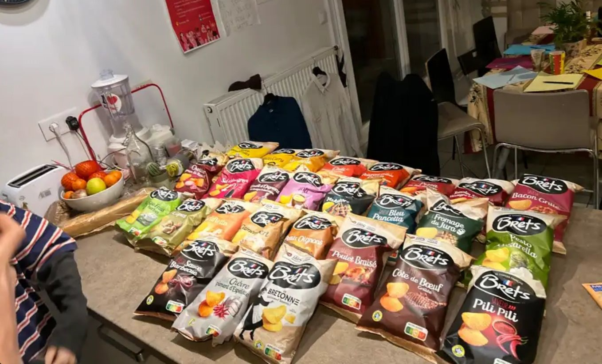

```{r library, echo=FALSE, eval=TRUE,warning=FALSE,message=FALSE,error=FALSE}

library(FactoMineR)
library(factoextra)
library(ade4)
library(dplyr)

```


# Introduction

Soirée pour déterminer la meilleur chips

## Présentation de l'étude

Soirée organisée par Rebecca en présence de 12 dégustateurs chevronnés.  
Étude réalisée sur les `r nrow(brets)` saveurs de chips de la marque Bret’s.  

Bret’s est la première marque de chips en France à avoir proposé des chips aromatisées, comme celles au poulet braisé, qui ont contribué à sa réputation à ses débuts. Dans les années 2010, cette saveur reste son best-seller et se classe numéro deux derrière les chips barbecue de Lay’s.[@rebetez2006heat]


```{r photos, echo=FALSE, out.width = '50%', fig.align = "center"}

```


## Présentation des differentes arome de chips
L'extrait de code en R présente une analyse des données relatives aux différents arômes de chips "Brets", stockées dans un fichier CSV appelé "bretz.csv". [@van2013climate]

```{r 4, echo=FALSE, eval=TRUE}


brets <- read.csv2("bretz.csv", header = TRUE, sep = ";", 
                     row.names = 1, encoding = "latin1")


dataf3 <- data.frame(brets,saveur=row.names(brets))
dataf3[,13]
```

# Dégustation des Chips :

La dégustation a été réalisée dans un ordre précis, chaque participant ayant goûté les différentes saveurs de chips et attribué une note sur 10. Ce processus a permis de recueillir les évaluations des participants, en fonction de leurs perceptions de chaque saveur.

Le tableau suivant présente les résultats de la dégustation, où chaque saveur de chips est accompagnée de la note moyenne attribuée par les participants. Ces notes reflètent les appréciations individuelles et collectives des chips selon les critères de goût, de texture, et d'originalité de chaque saveur.

```{r 5, echo=FALSE, eval=TRUE}

brets[,c(1,2,3,4,5,6)]
```
```{r 65, echo=FALSE, eval=TRUE}

brets[,c(7,8,9,10,11,12)]
```
```{r k, echo=FALSE, out.width = '50%', fig.align = "center"}

```

# resultat final

Le tableau des résultats montre les notes moyennes attribuées à différentes saveurs de chips par les participants à la dégustation. Voici une analyse détaillée de ces résultats :

## Résumé des résultats :
La Pizza arrive en tête du classement avec une note moyenne de 7.54, ce qui en fait la saveur préférée par les participants. Elle est suivie de près par Pesto mozza (7.50) et Tartiflettes (7.08), qui sont également parmi les saveurs les plus appréciées.

```{r 6, echo=FALSE, eval=TRUE}
sumli <- apply(brets, 1, sum)
sumco <- apply(brets, 2, sum)
sumli <- apply(brets, 1, mean)
sumco <- apply(brets, 2, mean)

classement<-data.frame(sumli)
classement1<-arrange(classement,sumli)
classement1

```


# ACP
L'Analyse en Composantes Principales (ACP) est une méthode statistique utilisée pour réduire la dimensionnalité des données tout en conservant l’essentiel de la variance. Dans ce contexte, l'ACP est appliquée aux notes des différentes saveurs de chips pour comprendre la répartition des appréciations des participants.

## Axe 1 explique la plus grande part de la variance :
```{r 7, echo=FALSE, eval=TRUE,fig.align = "center"}
res <- PCA(brets, graph = FALSE)
par(mfrow = c(1, 1), mar = c(4, 4, 2, 2))
barplot(res$eig[, 2], main = "Valeurs Propres", ylab = "Inertie %", names.arg = paste("Axe", 1: nrow(res$eig)))


```
- L'axe 1 représente la première composante principale et explique la majorité de la variance dans les données. Cela signifie que la première dimension est très importante pour comprendre les différences globales dans les notes des saveurs.

- Interprétation : L'axe 1 pourrait correspondre à un critère de généralité des goûts. Par exemple, les saveurs les plus populaires (comme Pizza, Tartiflettes) pourraient se situer à droite de l'axe 1, tandis que les saveurs moins populaires ou plus polarisantes (comme Bleu Pancetta, Cèpes) se situent à gauche. Cela montrerait que les participants sont d'accord pour dire que certaines saveurs sont meilleures que d’autres.

```{r 8, echo=FALSE, eval=TRUE,warning=FALSE,message=FALSE,error=FALSE,fig.align = "center"}
plot.PCA(res, choix = "var")


```

## les participants Max et Simon pers 2 et 7:
L'axe 2 pourrait séparer les participants selon un autre critère de préférence ou de divergence dans les notes. Si Max et Simon sont les seuls à expliquer l'axe 2, cela suggère que leurs évaluations sont très différentes des autres participants.
Interprétation : Cela pourrait signifier que Max et Simon ont des préférences très spécifiques ou polarisées, ce qui les place à des positions éloignées des autres participants. Par exemple, ces participants pourraient avoir attribué des notes très élevées ou très faibles à certaines saveurs (cela pourrait être un signe d’avis tranchés sur les goûts).

```{r 9, echo=FALSE, eval=TRUE,warning=FALSE,message=FALSE,error=FALSE,fig.align = "center"}

plot.PCA(res, choix = "ind")


```
Ceux qui sont situés vers le bas de l'ACP ont donné des notes particulièrement basses. Cela pourrait être des participants qui n'ont pas apprécié certaines saveurs, ou qui ont attribué des scores faibles de manière systématique.
Interprétation : Ces participants pourraient avoir une préférence pour des saveurs plus spécifiques ou moins populaires, et les saveurs moins bien notées dans le graphique pourraient être celles qu'ils ont fortement désapprouvées.

Ceux qui se trouvent à droite de l'axe 1 ont donné les meilleures notes. Cela indique que ces participants ont apprécié globalement les saveurs qui sont situées de ce côté du graphique.
Interprétation : Les saveurs qui apparaissent dans la partie droite de l'ACP sont probablement les plus populaires (comme Pizza, Cheddar oignon, Tartiflettes), ce qui signifie qu'elles ont eu des évaluations globalement élevées.

L'ACP met en évidence des tendances intéressantes dans les données de dégustation des chips. L'Axe 1 est crucial pour comprendre la majorité des préférences, avec des saveurs populaires occupant une position favorable à droite, tandis que l'Axe 2 semble être expliqué par des participants spécifiques comme Max et Simon, qui ont des préférences distinctes par rapport aux autres. Ceux qui se trouvent vers le bas du graphique sont ceux qui ont attribué des notes plus basses, tandis que ceux qui se trouvent à droite sur l'axe 1 ont donné des notes plus élevées aux saveurs.

Si vous avez accès aux graphiques ou souhaitez analyser des données plus spécifiques, je peux vous guider davantage dans l'interprétation des résultats visuels ou dans les prochaines étapes de l’analyse.
# CAH

5 clust mais fleme d'analyser.

```{r 10, echo=FALSE, eval=TRUE,warning=FALSE,message=FALSE,error=FALSE,fig.align = "center"}


hc <- HCPC(res, graph = FALSE, nb.clust = 5 )


#arbre des correlation

plot.HCPC(hc, choice = "tree")

# plot de la CAH

plot.HCPC(hc, choice = "map", draw.tree = FALSE) #plot generale


```


# conclusion

# Bibliographie


